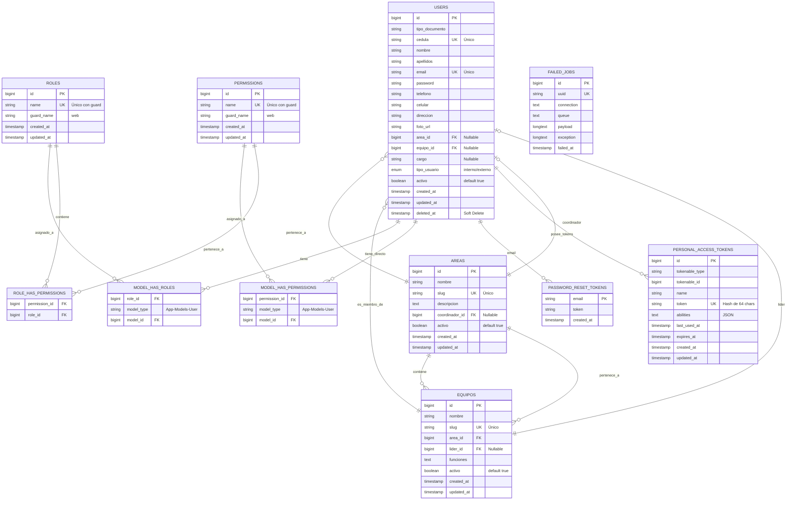
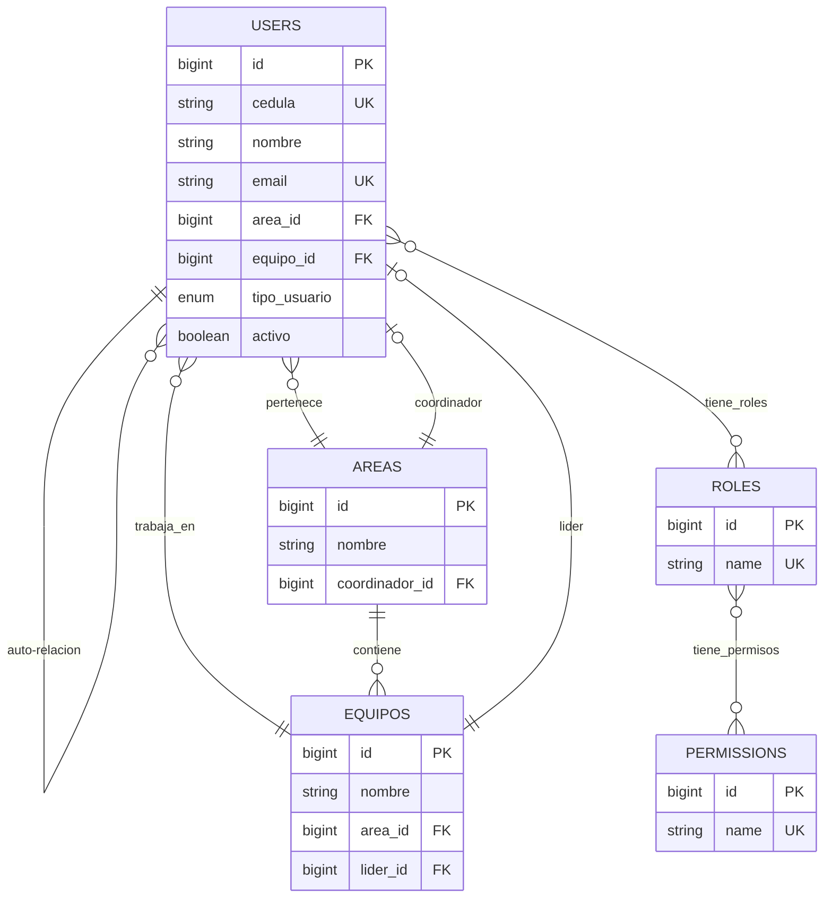

# 📊 Diagrama Entidad-Relación Visual - SIA

## 🎨 Diagrama Completo (Mermaid)

**Copia este código en:** https://mermaid.live/ para ver el diagrama visual



---

## 🎯 Diagrama Simplificado (Core)

**Solo las tablas principales y sus relaciones:**



---

## 🏗️ Arquitectura de Datos por Módulos

### Módulo de Usuarios 👥

```
USERS (Tabla Principal)
  ├── Información Personal
  │   ├── tipo_documento
  │   ├── cedula (único)
  │   ├── nombre
  │   ├── apellidos
  │   ├── email (único)
  │   ├── telefono
  │   ├── celular
  │   ├── direccion
  │   └── foto_url
  │
  ├── Información Laboral (solo internos)
  │   ├── area_id → AREAS
  │   ├── equipo_id → EQUIPOS
  │   └── cargo
  │
  ├── Configuración
  │   ├── tipo_usuario (interno/externo)
  │   ├── activo (boolean)
  │   └── password (hashed)
  │
  └── Permisos
      └── roles → MODEL_HAS_ROLES → ROLES → PERMISSIONS
```

### Módulo Organizacional 🏢

```
AREAS
  ├── nombre
  ├── slug (único)
  ├── descripcion
  ├── coordinador_id → USERS
  ├── activo
  └── RELACIONES:
      ├── hasMany(EQUIPOS)
      ├── hasMany(USERS)
      └── belongsTo(USER, coordinador)

EQUIPOS
  ├── nombre
  ├── slug (único)
  ├── area_id → AREAS
  ├── lider_id → USERS
  ├── funciones
  ├── activo
  └── RELACIONES:
      ├── belongsTo(AREA)
      ├── belongsTo(USER, lider)
      └── hasMany(USERS, miembros)
```

### Sistema de Permisos 🔐

```
SPATIE PERMISSION (Laravel Package)

PERMISSIONS
  └── name (ej: usuarios.ver, usuarios.crear)

ROLES
  ├── name (ej: Super Administrador, Funcionario)
  └── permissions[] (múltiples)

ASSIGNMENTS
  ├── model_has_roles (User → Role)
  ├── model_has_permissions (User → Permission directo)
  └── role_has_permissions (Role → Permission)
```

---

## 🔄 Flujo de Datos Típico

### Creación de Usuario Funcionario:

```
1. Crear registro en USERS
   ├── Datos personales
   ├── area_id = [área seleccionada]
   ├── equipo_id = [equipo seleccionado]
   └── tipo_usuario = 'interno'

2. Asignar roles
   └── Insertar en MODEL_HAS_ROLES
       ├── role_id = [rol seleccionado]
       ├── model_type = 'App\Models\User'
       └── model_id = [id del usuario]

3. Actualizar estadísticas
   ├── Incrementar contador en AREA
   └── Incrementar contador en EQUIPO
```

### Verificación de Permisos:

```
Usuario intenta acción → Verificar permiso

1. Obtener roles del usuario
   └── SELECT * FROM model_has_roles WHERE model_id = ?

2. Obtener permisos de esos roles
   └── SELECT * FROM role_has_permissions WHERE role_id IN (...)

3. Obtener permisos directos
   └── SELECT * FROM model_has_permissions WHERE model_id = ?

4. Unir todos los permisos
   └── UNION de permisos de roles + permisos directos

5. Verificar si tiene el permiso requerido
   └── IF 'usuarios.ver' IN permisos → PERMITIR
```

---

## 📈 Diagrama de Cardinalidades

```
                    1                    N
    AREA ────────────────────────── EQUIPOS
      │ 1                               │ 1
      │                                 │
      │ N                               │ N
      └───────── USERS ─────────────────┘
                   │ N
                   │
                   │ M
                   │
              ┌────┴────┐
              │         │
           N  │         │  N
              │         │
              ▼         ▼
           ROLES ───── PERMISSIONS
              M           M
```

**Leyenda:**
- 1 = Uno
- N = Muchos
- M = Muchos a Muchos

---

## 🛠️ Herramientas para Visualizar

### Online (Recomendado):
1. **Mermaid Live Editor:** https://mermaid.live/
   - Copia el código Mermaid de arriba
   - Visualiza y exporta como PNG/SVG

2. **DB Diagram:** https://dbdiagram.io/
   - Usa sintaxis DBML
   - Genera diagramas profesionales

3. **DrawSQL:** https://drawsql.app/
   - Importa desde SQL
   - Editor visual interactivo

### Herramientas Locales:
1. **MySQL Workbench** - Reverse engineer desde BD
2. **DBeaver** - Genera ER diagrams automáticamente
3. **phpMyAdmin** - Designer view

---

## 📝 Notas Importantes

### Características Especiales:

1. **Soft Deletes en Users**
   - Los usuarios NO se eliminan físicamente
   - Campo `deleted_at` marca eliminación lógica

2. **Relaciones Auto-referenciadas**
   - Area → coordinador (User)
   - Equipo → líder (User)
   - Pueden crear ciclos si no se maneja bien

3. **Polimorfismo en Permisos**
   - `model_type` permite asignar roles/permisos a diferentes entidades
   - Actualmente solo se usa con User

4. **Guard Names**
   - Todos usan 'web' por defecto
   - Permite múltiples sistemas de autenticación

---

## ✅ Archivo Generado

- `MODELO_ENTIDAD_RELACION.md` - Documentación completa
- `DIAGRAMA_ER_VISUAL.md` - Este archivo con diagramas visuales

**Para ver el diagrama:**
1. Abre https://mermaid.live/
2. Copia el código Mermaid de arriba
3. ¡Visualiza el diagrama completo!


