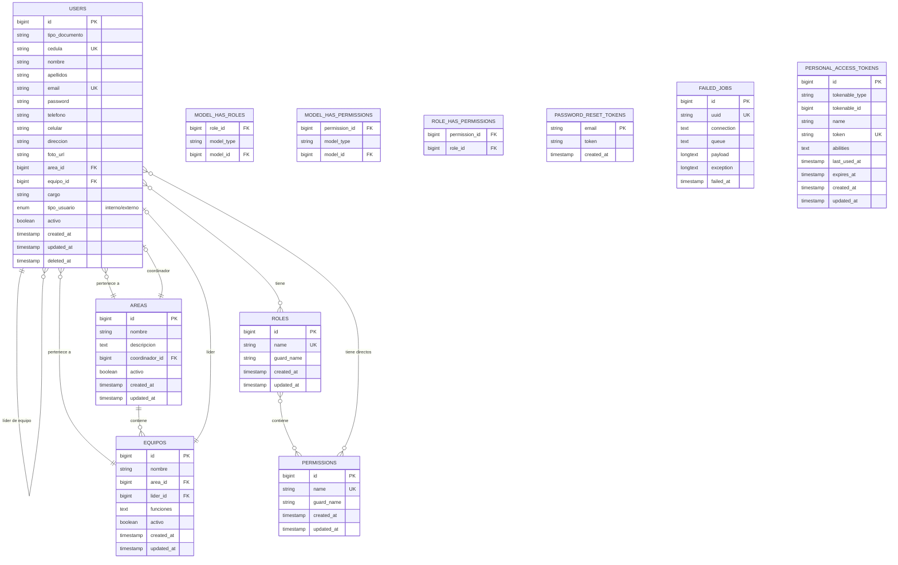

# 📊 Modelo Entidad-Relación - Sistema SIA

## 🗄️ Diagrama ER (Mermaid)



---

## 📋 Descripción de Tablas

### 1. **USERS (Usuarios)** 👥
**Tabla central del sistema**

| Campo | Tipo | Descripción |
|-------|------|-------------|
| id | BIGINT | Identificador único |
| tipo_documento | VARCHAR | CC, CE, Pasaporte |
| cedula | VARCHAR | Número de documento (único) |
| nombre | VARCHAR | Nombres del usuario |
| apellidos | VARCHAR | Apellidos del usuario |
| email | VARCHAR | Correo electrónico (único) |
| password | VARCHAR | Contraseña hasheada |
| telefono | VARCHAR | Teléfono fijo |
| celular | VARCHAR | Teléfono celular |
| direccion | VARCHAR | Dirección de residencia |
| foto_url | VARCHAR | URL de foto de perfil |
| area_id | BIGINT | FK a AREAS |
| equipo_id | BIGINT | FK a EQUIPOS |
| cargo | VARCHAR | Cargo del funcionario |
| tipo_usuario | ENUM | 'interno' o 'externo' |
| activo | BOOLEAN | Estado del usuario |
| created_at | TIMESTAMP | Fecha de creación |
| updated_at | TIMESTAMP | Fecha de actualización |
| deleted_at | TIMESTAMP | Soft delete |

**Relaciones:**
- `belongsTo(Area)` → Un usuario pertenece a un área
- `belongsTo(Equipo)` → Un usuario pertenece a un equipo
- `hasMany(Area, 'coordinador_id')` → Un usuario puede ser coordinador de áreas
- `hasMany(Equipo, 'lider_id')` → Un usuario puede ser líder de equipos
- `belongsToMany(Role)` → Un usuario tiene múltiples roles
- `belongsToMany(Permission)` → Un usuario puede tener permisos directos

---

### 2. **AREAS (Áreas Organizacionales)** 🏢

| Campo | Tipo | Descripción |
|-------|------|-------------|
| id | BIGINT | Identificador único |
| nombre | VARCHAR | Nombre del área |
| slug | VARCHAR | Slug único para URLs |
| descripcion | TEXT | Descripción del área |
| coordinador_id | BIGINT | FK a USERS (coordinador) |
| activo | BOOLEAN | Estado del área |
| created_at | TIMESTAMP | Fecha de creación |
| updated_at | TIMESTAMP | Fecha de actualización |

**Relaciones:**
- `belongsTo(User, 'coordinador_id')` → Un área tiene un coordinador
- `hasMany(Equipo)` → Un área tiene múltiples equipos
- `hasMany(User)` → Un área tiene múltiples usuarios

**Reglas:**
- Un área puede tener un solo coordinador
- Un área puede tener múltiples equipos
- Un coordinador debe ser un usuario interno

---

### 3. **EQUIPOS (Equipos de Trabajo)** 👥

| Campo | Tipo | Descripción |
|-------|------|-------------|
| id | BIGINT | Identificador único |
| nombre | VARCHAR | Nombre del equipo |
| slug | VARCHAR | Slug único para URLs |
| area_id | BIGINT | FK a AREAS |
| lider_id | BIGINT | FK a USERS (líder) |
| funciones | TEXT | Descripción de funciones |
| activo | BOOLEAN | Estado del equipo |
| created_at | TIMESTAMP | Fecha de creación |
| updated_at | TIMESTAMP | Fecha de actualización |

**Relaciones:**
- `belongsTo(Area)` → Un equipo pertenece a un área
- `belongsTo(User, 'lider_id')` → Un equipo tiene un líder
- `hasMany(User)` → Un equipo tiene múltiples miembros

**Reglas:**
- Un equipo pertenece a una sola área
- Un equipo puede tener un solo líder
- Un líder debe ser un usuario interno del área

---

### 4. **ROLES (Roles del Sistema)** 🎭

| Campo | Tipo | Descripción |
|-------|------|-------------|
| id | BIGINT | Identificador único |
| name | VARCHAR | Nombre del rol (único) |
| guard_name | VARCHAR | Guard de autenticación |
| created_at | TIMESTAMP | Fecha de creación |
| updated_at | TIMESTAMP | Fecha de actualización |

**Relaciones:**
- `belongsToMany(Permission)` → Un rol tiene múltiples permisos
- `belongsToMany(User)` → Un rol puede ser asignado a múltiples usuarios

**Ejemplos de Roles:**
- Super Administrador
- Director OAPM
- Coordinador
- Líder de Equipo
- Funcionario
- Ciudadano

---

### 5. **PERMISSIONS (Permisos)** 🔐

| Campo | Tipo | Descripción |
|-------|------|-------------|
| id | BIGINT | Identificador único |
| name | VARCHAR | Nombre del permiso (único) |
| guard_name | VARCHAR | Guard de autenticación |
| created_at | TIMESTAMP | Fecha de creación |
| updated_at | TIMESTAMP | Fecha de actualización |

**Relaciones:**
- `belongsToMany(Role)` → Un permiso puede estar en múltiples roles
- `belongsToMany(User)` → Un permiso puede ser asignado directamente a usuarios

**Estructura de Nombres:**
- `modulo.accion`
- Ejemplos: `usuarios.ver`, `usuarios.crear`, `usuarios.editar`, `usuarios.eliminar`

---

### 6. **MODEL_HAS_ROLES (Pivot)** 🔗

**Tabla de relación muchos a muchos entre Usuarios y Roles**

| Campo | Tipo | Descripción |
|-------|------|-------------|
| role_id | BIGINT | FK a ROLES |
| model_type | VARCHAR | Tipo de modelo (App\Models\User) |
| model_id | BIGINT | FK al modelo (user.id) |

**Uso:** Polimórfica - puede asignar roles a diferentes tipos de modelos

---

### 7. **ROLE_HAS_PERMISSIONS (Pivot)** 🔗

**Tabla de relación muchos a muchos entre Roles y Permisos**

| Campo | Tipo | Descripción |
|-------|------|-------------|
| permission_id | BIGINT | FK a PERMISSIONS |
| role_id | BIGINT | FK a ROLES |

**Uso:** Define qué permisos tiene cada rol

---

### 8. **MODEL_HAS_PERMISSIONS (Pivot)** 🔗

**Permisos directos asignados a usuarios**

| Campo | Tipo | Descripción |
|-------|------|-------------|
| permission_id | BIGINT | FK a PERMISSIONS |
| model_type | VARCHAR | Tipo de modelo |
| model_id | BIGINT | FK al modelo |

**Uso:** Permite asignar permisos específicos a usuarios sin crear un rol

---

### 9. **PASSWORD_RESET_TOKENS** 🔑

| Campo | Tipo | Descripción |
|-------|------|-------------|
| email | VARCHAR | Email del usuario (PK) |
| token | VARCHAR | Token de reseteo |
| created_at | TIMESTAMP | Fecha de creación |

**Uso:** Gestión de recuperación de contraseñas

---

### 10. **FAILED_JOBS** ❌

| Campo | Tipo | Descripción |
|-------|------|-------------|
| id | BIGINT | Identificador único |
| uuid | VARCHAR | UUID del job |
| connection | TEXT | Conexión de cola |
| queue | TEXT | Nombre de cola |
| payload | LONGTEXT | Datos del job |
| exception | LONGTEXT | Excepción generada |
| failed_at | TIMESTAMP | Fecha de fallo |

**Uso:** Registro de jobs fallidos en cola

---

### 11. **PERSONAL_ACCESS_TOKENS** 🎫

| Campo | Tipo | Descripción |
|-------|------|-------------|
| id | BIGINT | Identificador único |
| tokenable_type | VARCHAR | Tipo de modelo |
| tokenable_id | BIGINT | FK al modelo |
| name | VARCHAR | Nombre del token |
| token | VARCHAR | Token único (hash) |
| abilities | TEXT | Permisos del token (JSON) |
| last_used_at | TIMESTAMP | Último uso |
| expires_at | TIMESTAMP | Fecha de expiración |
| created_at | TIMESTAMP | Fecha de creación |
| updated_at | TIMESTAMP | Fecha de actualización |

**Uso:** Autenticación API con Sanctum

---

## 🔗 Relaciones Principales

### Jerarquía Organizacional:

```
AREA (Departamento/División)
  ├── coordinador: USER
  ├── EQUIPOS (múltiples)
  │     ├── lider: USER
  │     └── miembros: USERS (múltiples)
  └── usuarios: USERS (múltiples)
```

### Sistema de Permisos (Spatie):

```
USER
  ├── roles: ROLES (múltiples) [via MODEL_HAS_ROLES]
  │     └── permissions: PERMISSIONS (múltiples) [via ROLE_HAS_PERMISSIONS]
  └── permissions directos: PERMISSIONS (múltiples) [via MODEL_HAS_PERMISSIONS]
```

---

## 📝 Cardinalidades

| Relación | Tipo | Descripción |
|----------|------|-------------|
| User → Area | N:1 | Muchos usuarios en un área |
| User → Equipo | N:1 | Muchos usuarios en un equipo |
| Area → User (coordinador) | 1:1 | Un área tiene un coordinador |
| Equipo → User (líder) | 1:1 | Un equipo tiene un líder |
| Area → Equipos | 1:N | Un área tiene muchos equipos |
| Equipo → Area | N:1 | Muchos equipos en un área |
| User → Roles | N:M | Usuarios tienen múltiples roles |
| Role → Permissions | N:M | Roles tienen múltiples permisos |
| User → Permissions | N:M | Usuarios pueden tener permisos directos |

---

## 🎯 Reglas de Negocio

### Usuarios:
1. ✅ Un usuario puede ser **funcionario** (interno) o **ciudadano** (externo)
2. ✅ Solo funcionarios tienen área, equipo y cargo
3. ✅ Un usuario puede ser coordinador de UN área
4. ✅ Un usuario puede ser líder de UN equipo
5. ✅ Un usuario debe tener al menos UN rol
6. ✅ Email y cédula son únicos
7. ✅ Usa soft deletes (no se eliminan físicamente)

### Áreas:
1. ✅ Deben tener un nombre y slug únicos
2. ✅ Pueden tener un coordinador (opcional)
3. ✅ Contienen múltiples equipos
4. ✅ Contienen múltiples usuarios

### Equipos:
1. ✅ Pertenecen a UN área
2. ✅ Pueden tener un líder (opcional)
3. ✅ El líder debe ser del área correspondiente
4. ✅ Tienen múltiples miembros

### Roles y Permisos:
1. ✅ Los roles agrupan permisos
2. ✅ Un usuario puede tener múltiples roles
3. ✅ Los permisos se heredan de los roles
4. ✅ Se pueden asignar permisos directos a usuarios (sin rol)
5. ✅ Formato de permisos: `modulo.accion` (ej: `usuarios.ver`)

---

## 📐 Diagrama Visual Simplificado

```
┌─────────────────────────────────────────────────────────────┐
│                         AREA                                │
│  + id                                                       │
│  + nombre                                                   │
│  + coordinador_id ───────┐                                 │
└──────────────┬────────────┼──────────────────────────────┬──┘
               │            │                              │
               │            │                              │
        contiene equipos    │                     contiene usuarios
               │            │                              │
               ▼            │                              ▼
┌──────────────────────┐   │                   ┌─────────────────────┐
│       EQUIPO         │   │                   │        USER         │
│  + id                │   │                   │  + id               │
│  + nombre            │   │                   │  + cedula           │
│  + area_id ──────────┘   │                   │  + nombre           │
│  + lider_id ─────────────┘                   │  + email            │
└──────┬───────────────┘                       │  + tipo_usuario     │
       │                                       │  + area_id          │
       │                                       │  + equipo_id        │
       │                                       └──────┬──────────────┘
       │                                              │
    tiene miembros                              tiene roles
       │                                              │
       └──────────────────────────────────────────────┘
                              │
                              ▼
                    ┌──────────────────┐
                    │       ROLE       │
                    │  + id            │
                    │  + name          │
                    └────────┬─────────┘
                             │
                      tiene permisos
                             │
                             ▼
                    ┌──────────────────┐
                    │   PERMISSION     │
                    │  + id            │
                    │  + name          │
                    └──────────────────┘
```

---

## 🔑 Índices y Constraints

### Unique Constraints:
- `users.email` → Único
- `users.cedula` → Único
- `areas.slug` → Único
- `equipos.slug` → Único
- `roles.name + guard_name` → Único compuesto
- `permissions.name + guard_name` → Único compuesto

### Foreign Keys:
- `users.area_id` → `areas.id`
- `users.equipo_id` → `equipos.id`
- `areas.coordinador_id` → `users.id`
- `equipos.area_id` → `areas.id`
- `equipos.lider_id` → `users.id`

### Cascade Actions:
- Al eliminar un rol → Elimina relaciones en `model_has_roles`
- Al eliminar un permiso → Elimina relaciones en `role_has_permissions`
- Al eliminar usuario → Soft delete (no elimina físicamente)

---

## 📊 Estadísticas Actuales del Esquema

| Métrica | Valor |
|---------|-------|
| Tablas principales | 3 (Users, Areas, Equipos) |
| Tablas de autenticación | 4 (Roles, Permissions, tokens, etc.) |
| Tablas pivot | 3 (model_has_roles, etc.) |
| Total de tablas | 11 |
| Relaciones many-to-many | 3 |
| Relaciones one-to-many | 4 |
| Relaciones one-to-one | 2 |

---

## 🚀 Extensiones Futuras Sugeridas

### Tablas a Agregar:

1. **TAREAS** 📋
   - Para gestión de tareas
   - FK a usuario_asignado_id
   - FK a area_id, equipo_id

2. **SOLICITUDES** 📨
   - Para solicitudes de ciudadanos
   - FK a usuario_id (solicitante)
   - FK a usuario_asignado_id

3. **DOCUMENTOS** 📄
   - Para gestión documental
   - FK a usuario_id (creador)
   - FK a area_id

4. **ACTIVITY_LOG** 📊
   - Para auditoría completa
   - FK a user_id
   - Registro de todas las acciones

5. **NOTIFICACIONES** 🔔
   - Para sistema de notificaciones
   - FK a user_id
   - Polimórfica a diferentes entidades

---

## 📖 Consultas SQL Comunes

### Obtener usuarios con su área y equipo:
```sql
SELECT u.*, a.nombre as area_nombre, e.nombre as equipo_nombre
FROM users u
LEFT JOIN areas a ON u.area_id = a.id
LEFT JOIN equipos e ON u.equipo_id = e.id
WHERE u.activo = true;
```

### Obtener coordinadores de áreas:
```sql
SELECT a.nombre as area, u.nombre, u.apellidos
FROM areas a
INNER JOIN users u ON a.coordinador_id = u.id
WHERE a.activo = true;
```

### Obtener líderes de equipos:
```sql
SELECT e.nombre as equipo, u.nombre, u.apellidos, a.nombre as area
FROM equipos e
INNER JOIN users u ON e.lider_id = u.id
INNER JOIN areas a ON e.area_id = a.id
WHERE e.activo = true;
```

### Obtener permisos efectivos de un usuario:
```sql
SELECT DISTINCT p.name
FROM permissions p
INNER JOIN role_has_permissions rhp ON p.id = rhp.permission_id
INNER JOIN model_has_roles mhr ON rhp.role_id = mhr.role_id
WHERE mhr.model_type = 'App\\Models\\User'
  AND mhr.model_id = ?
UNION
SELECT p.name
FROM permissions p
INNER JOIN model_has_permissions mhp ON p.id = mhp.permission_id
WHERE mhp.model_type = 'App\\Models\\User'
  AND mhp.model_id = ?;
```

---

## 🎨 Diagrama en Texto ASCII

```
┌──────────────────────┐
│       USERS          │
│ ─────────────────    │
│ • id (PK)            │◄────┐
│ • cedula (UK)        │     │
│ • nombre             │     │
│ • email (UK)         │     │ coordinador_id
│ • area_id (FK)       │─────┼─────────┐
│ • equipo_id (FK)     │─┐   │         │
│ • tipo_usuario       │ │   │         │
│ • activo             │ │   │         ▼
└──────────────────────┘ │   │   ┌──────────────┐
          │              │   │   │    AREAS     │
          │              │   │   │ ──────────── │
      tiene roles        │   │   │ • id (PK)    │
          │              │   └───│ • coord_id   │
          ▼              │       │ • nombre     │
┌──────────────────┐    │       │ • activo     │
│      ROLES       │    │       └───────┬──────┘
│ ──────────────   │    │               │
│ • id (PK)        │    │           contiene
│ • name (UK)      │    │               │
└────────┬─────────┘    │               ▼
         │              │       ┌──────────────┐
    tiene permisos      │       │   EQUIPOS    │
         │              │       │ ──────────── │
         ▼              │       │ • id (PK)    │
┌──────────────────┐   │       │ • area_id    │
│   PERMISSIONS    │   │       │ • lider_id   │◄─┐
│ ──────────────   │   │       │ • nombre     │  │
│ • id (PK)        │   │       └──────────────┘  │
│ • name (UK)      │   │                         │
└──────────────────┘   └─────────────────────────┘
                           pertenece a equipo
```

---

## 📄 Archivo Generado

**Fecha:** Octubre 2024  
**Basado en:** Modelos Laravel y Migraciones  
**Herramientas:** Spatie Permission Package  
**Estado:** ✅ Documentado

---

**Notas:**
- Usa Spatie Permission para roles y permisos
- Implementa soft deletes en usuarios
- Soporta relaciones polimórficas
- Preparado para escalabilidad


